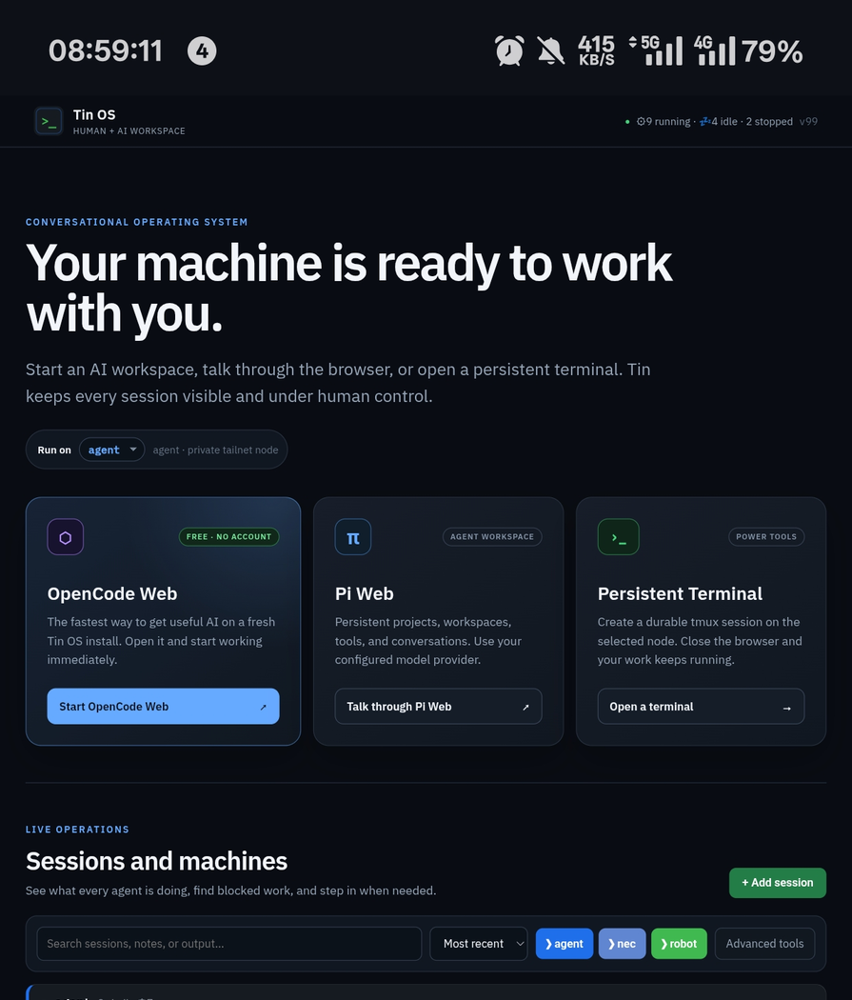

# Tin OS

**Install it. Connect it. Open a browser and work with your machine.**

Tin OS is a self-hosted browser home for human + AI work. It gives a fresh machine
an immediate AI path, persistent work sessions, and one place for the operator to
see what is running.

[Live public story and narrated pitch](https://agentdo.agency/tin) ·
[Full 7-minute viewer](https://agentdo.agency/slides/viewer.html?src=human-agentos&title=Tin%20OS%20Pitch)



> The image above was captured from the live Tin fleet on a real phone. It is not
> a mockup. The public crop intentionally excludes terminal contents and private
> network details.

## The idea

Most AI systems begin with setup friction: create accounts, collect API keys,
learn terminal commands, and manually keep processes alive.

Tin OS reverses the order:

```text
Install Tin OS
  -> connect the machine to a trusted network
  -> open http://<machine-ip>:8080
  -> press Start OpenCode Web
  -> useful AI is available immediately
```

- **OpenCode Web is the free first-value lane.** No Tin account is required.
- **Pi Web is the configured-provider lane** for persistent projects and richer
  agent workspaces.
- **tmux sessions are the process layer.** Closing a browser does not kill work.
- **The dashboard is the OS home.** Terminals are power tools, not the onboarding
  experience.

For the P4 challenge language: **Tin OS is a working Human-AgentOS** — an operating
layer for assigning, running, observing, and governing human + AI work.

## Try the runnable submission snapshot

Requirements: Linux, Python 3.11+, and tmux.

```bash
git clone https://github.com/DigitalVersion/tinagent-os.git
cd tinagent-os
python3 -m tin_os.server --host 0.0.0.0 --port 8080
```

Open:

```text
http://127.0.0.1:8080
# or from another device on a trusted network:
http://<machine-ip>:8080
```

The runtime has **zero Python package dependencies**. It uses the standard library
and calls tmux through fixed, auditable commands.

### Install as a boot service

On Debian, Ubuntu, or Kubuntu:

```bash
sudo AGENT_USER="$USER" bash install/install-tin.sh
```

The installer:

- installs Python, tmux, curl, and CA certificates,
- copies the runtime to `/opt/tin-os`,
- installs and starts `tin-os.service`,
- prints the LAN and tailnet URLs,
- verifies `/api/status` before reporting success.

### Install the AI applications

Run as the desktop owner:

```bash
bash install/install-ai-apps.sh
```

This installs:

- OpenCode through its official installer,
- Pi Web through npm when a current Node.js/npm runtime is available.

Return to Tin OS and press **Start OpenCode Web** or **Start Pi Web**. Tin starts
the selected app in a persistent tmux session and opens its browser door.

## What is built in this repository

| Capability | Status | Evidence |
| --- | --- | --- |
| English-first Tin OS browser home | Built | `tin_os/web/` |
| OpenCode Web detection and one-click start | Built | `POST /api/modules/opencode/start` |
| Pi Web detection and one-click start | Built | `POST /api/modules/pi/start` |
| Live tmux session inventory | Built | `GET /api/sessions` |
| Last-output session cards | Built | tmux `capture-pane` |
| Create/list/stop bounded sessions | Built | `/api/sessions` |
| Boot-persistent systemd installation | Built | `install/install-tin.sh` |
| Automated cold-start smoke test | Built | `scripts/smoke-test.sh` |
| Kubuntu ISO build lane | Experimental | `.github/workflows/build-iso.yml` |
| Multi-machine federation and WTerm | Live prototype, not packaged here yet | public pitch/screenshots |
| Approval broker and durable job evidence | Roadmap | documented below |

This table is deliberately strict. Planned functionality is not presented as built.

## Architecture

```text
Phone / laptop browser
        |
        |  http://<machine-ip>:8080
        v
+-----------------------------------------------+
| Tin OS browser home                           |
| OpenCode Web · Pi Web · persistent sessions   |
+----------------------+------------------------+
                       |
                       v
+-----------------------------------------------+
| Tin runtime (Python standard library)         |
| - module health/start API                     |
| - bounded tmux session API                    |
| - live output snapshots                       |
+----------------------+------------------------+
                       |
          +------------+-------------+
          |                          |
          v                          v
  OpenCode Web :2023          Pi Web :2024
          |
          v
  tmux + Linux services
```

## Why tmux

A browser tab is not a process manager. tmux lets the machine keep work alive when
the operator closes a tab, changes networks, or reconnects from a phone.

Tin exposes tmux state as an operator-friendly dashboard rather than asking a new
user to learn tmux first.

## Security boundary

This submission runtime intentionally has no public-internet authentication layer.
It can create and stop local tmux sessions and launch installed AI web apps.

**Use it only on a trusted LAN or private tailnet. Do not publish port 8080, 2023,
or 2024 to the public internet.**

The runtime does not expose an arbitrary shell-command API. Session startup is
restricted to this allowlist:

```text
bash · opencode · pi · claude · codex
```

The production roadmap adds owner authentication and a privileged approval broker
before Tin becomes a general appliance.

## P4 — Human-AgentOS fit

Tin OS directly demonstrates the execution/governance wedge of Human-AgentOS:

1. **Who should do the work?** The operator selects an AI workspace or human terminal.
2. **Can an AI agent do it?** OpenCode and Pi are first-class worker runtimes.
3. **How should agents be selected?** The home screen separates free/default and
   configured-provider lanes.
4. **How do mixed teams collaborate?** Humans observe persistent sessions and step
   in without killing agent work.
5. **How is work measured?** The live system exposes running/idle/stopped state and
   session evidence; durable outcome analytics are the next layer.

## Repository map

```text
tinagent-os/
├── tin_os/
│   ├── server.py               # runnable Tin OS runtime
│   └── web/                    # English-first browser home
├── install/
│   ├── install-tin.sh          # systemd installation
│   ├── install-ai-apps.sh      # OpenCode + optional Pi Web
│   ├── bootstrap.sh            # experimental Kubuntu/ISO substrate
│   └── setup-browser.sh        # optional Chrome/CDP substrate
├── scripts/
│   ├── smoke-test.sh           # cold-start + tmux E2E test
│   └── check-no-private-data.sh
├── docs/
│   ├── product-philosophy.md
│   ├── first-boot-flow.md
│   ├── inventory-gap.md
│   └── assets/
└── .github/workflows/build-iso.yml
```

## Verify

```bash
bash scripts/check-no-private-data.sh
bash scripts/smoke-test.sh
```

Expected smoke result:

```text
PASS: Tin OS cold-start runtime, static UI, status API, tmux create/list/delete
```

## Roadmap

1. Bundle the dashboard and AI runtimes into the ISO lane.
2. Show a QR code and local address on first boot.
3. Add `tin.local` discovery.
4. Package the live WTerm/tmux browser terminal.
5. Add owner authentication and explicit privileged-action approval.
6. Add durable job, evidence, handoff, backup, restore, and update layers.
7. Ship a preinstalled **Tin Box** appliance.

## Name

- Product: **Tin OS**
- Repository/package: `tinagent-os`
- Challenge category: **Human-AgentOS**

> Tin OS turns a connected machine into a conversational command center for human
> and AI work.

## License

MIT.
